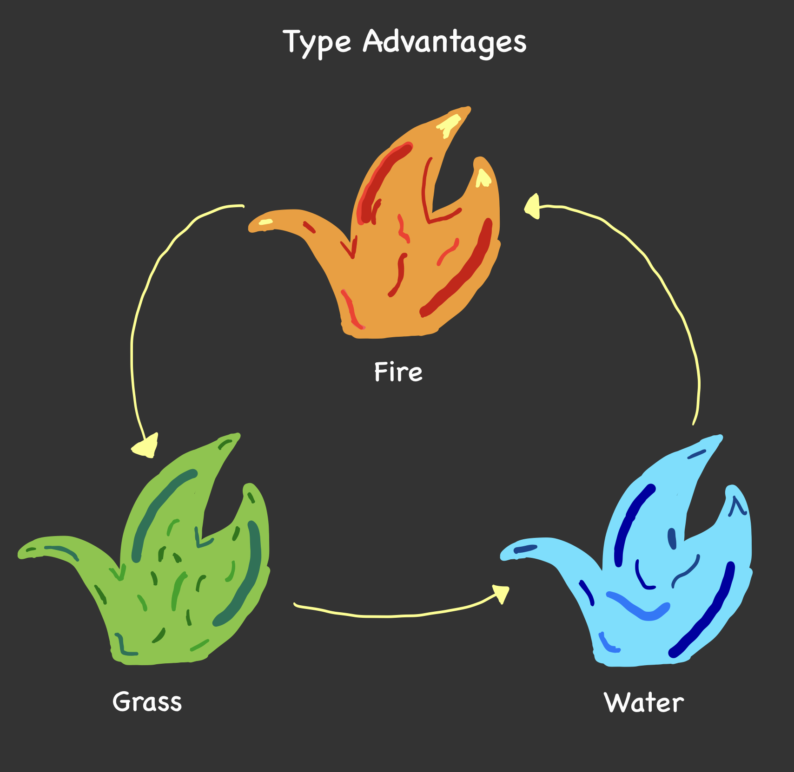

#  Monster Fighting Simulator -  **Mostromon** 

##  **What will the application do?**

The application will implement monster collection and battling. Monsters will have certain attributes such as names, types and health-points. The application will allow users to create and name monsters, choose their types and the amount of health-points they have. Then, they will be able to compose a team of 5 monsters that can battle amongst another team of 5 monsters. The application will then battle the two teams, and determine the victor of the battle. The application can be closed and reopened, and all progress made will remain intact. As such, users can run the program anytime, anywhere and enjoy the world of Monstermon. 

###  Monster Collection 

Monsters can be collected by creating a new Monster, with a name, type and health-points and adding it to a particular team. These teams can then be used to battle against each other.

###  Monster Battling 

Monsters will be able to be of the following types: fire, water and plant. When one monster is fighting another monster, it will have a base damage of 50. This number will be multiplied by a multiplier, depending on the type of the opposing monster that is being fought. If the user's monster has a type-advantage, this multiplier would be 1.5, while it would be 0.5 if the monster is at a type-disadvantage. 

 Type advantages and disadvantages will be determined as follows: 

When two monsters are pitted against each other, they will fight each other until the health-points of either monster is reduced to 0. At this point, the next monster in the team would replace the fainted monster. This would continue until either team of monsters has fainted, deeming the other team victorious.

###  Implementation 

In code, the application would be implemented using two classes: Monster and Team. The Monster class would represent a monster, with its attributes being name, type and health-points. The Team class would be a list of Monster objects implemented using ArrayLists. The Team class would also have attributes, including name and the list of monsters it contains.

The Monster class would have methods including renameMonster(), getHp() and getType(). The Team class would have methods including renameTeam(), addToTeam(), removeFromTeam() and battle(). 

##  **Who will use it?**

 

Those passionate about monster battling or fans of role-playing battle simulation games will use this application. This application can be enjoyed by people of all ages, as they create monsters and teams to strategically develop teams that can fight and win against other teams.

##  **Why is this project of interest to you?**

 

This project is of special interest to me as I have and will continue to be a massive fan of the Pokémon franchise. My love for the monster collection and battling franchise will only grow more by understanding the functionalities and implementation of incredible concepts of Pokémon. The engaging stories and adventure style of the Pokémon games always stood out to me, and helped me develop problem-solving skills and strategy. By making a smaller scale simulation under the Pokémon collection and battling theme, I hope to take my understanding of Pokémon and Java to a new level together.

